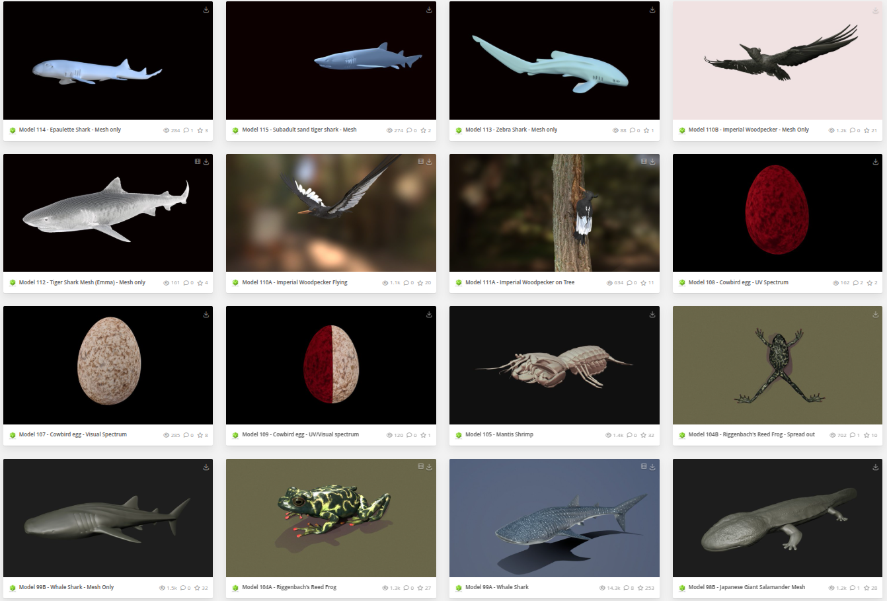
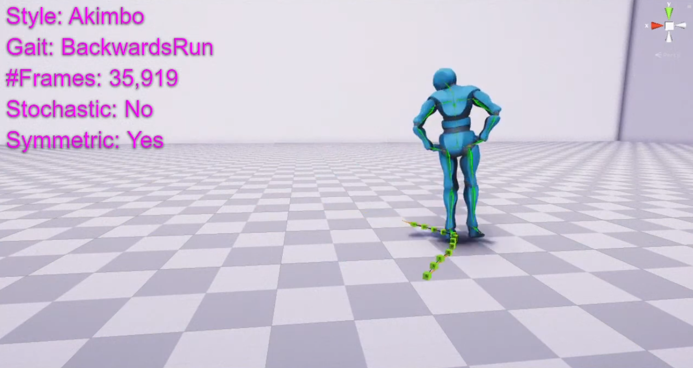

# Awesome-Character-Animation

Curation of research papers and datasets related to 3D character motion analysis, generation and transfer.

Table of Contents
=================

- [Papers](#papers)
	- [Rig Free Motion Transfer](#rig-free-motion-transfer)
   	- [Motion Transfer for Rigged Characters](#motion-transfer-for-rigged-characters)
	- [Cross Domain Motion Retargeting](#cross-domain-motion-retargeting)
   	- [Text to Motion Generation](#text-to-motion-generation)
   	- [Text based Motion Editing](#text-based-motion-editing)
   	- [Motion Interpolation](#motion-interpolation)
   	- [Motion Synthesis](#motion-synthesis)
   	- [Motion Decomposition](#motion-decomposition)
   	- [Motion Stylization](#motion-stylization)
   	- [Motion Editing](#motion-editing)
   	- [Character-Scene Interaction](#character-scene-interaction)
   	  
   	
- [Datasets](#datasets)

# Papers

## Rig Free Motion Transfer
#### 2025
- [SMF: Template-free and Rig-free Animation Transfer using Kinetic Codes](https://motionfields.github.io/) \
  Sanjeev Muralikrishnan, Niladri Shekhar Dutt1, Niloy Mitra \
  ArXiv 2025
  
#### 2024
- [Temporal Residual Jacobians for Rig-free Motion Transfer](https://temporaljacobians.github.io/) \
  Sanjeev Muralikrishnan, Niladri Shekhar Dutt, Siddhartha Chaudhuri, Noam Aigerman, Vladimir Kim, Matthew Fisher, Niloy Mitra \
  ECCV 2024
  
#### 2023		
- [Zero-shot Pose Transfer for Unrigged Stylized 3D Characters](https://jiashunwang.github.io/ZPT/)\
  Jiashun Wang,  Xueting Li,  Sifei Liu,  Shalini De Mello,  Orazio Gallo,  Xiaolong Wang,  Jan Kautz \
  CVPR 2023

#### 2022
- [Skeleton-free Pose Transfer for Stylized 3D Characters](https://zycliao.com/sfpt/) \
  Zhouyingcheng Liao,  Jimei Yang,  Jun Saito,  Gerard Pons-Moll,  Yang Zhou \
  ECCV 2022
  

## Motion Transfer for Rigged Characters
#### 2024
- [Semantics-aware Motion Retargeting with Vision-Language Models](https://openaccess.thecvf.com/content/CVPR2024/papers/Zhang_Semantics-aware_Motion_Retargeting_with_Vision-Language_Models_CVPR_2024_paper.pdf) \
  Haodong Zhang, Zhike Chen, Haocheng Xu, Lei Hao, Xiaofei Wu, Songcen Xu, Zhensong Zhang, Yue Wang, Rong Xiong \
  CVPR 2024
  
#### 2023
- [Skinned Motion Retargeting with Residual Perception of Motion Semantics & Geometry](https://openaccess.thecvf.com/content/CVPR2023/papers/Zhang_Skinned_Motion_Retargeting_With_Residual_Perception_of_Motion_Semantics__CVPR_2023_paper.pdf) \
  Jiaxu Zhang, Junwu Weng, Di Kang, Fang Zhao, Shaoli Huang, Xuefei Zhe, Linchao Bao, Ying Shan, Jue Wang, Zhigang Tu \
  CVPR 2023
  

## Cross Domain Motion Retargeting 
#### 2024
- [WalkTheDog: Cross-Morphology Motion Alignment via Phase Manifolds](https://dl.acm.org/doi/pdf/10.1145/3641519.3657508) \
  Peizhuo Li, Sebastian Starke, Yuting Ye, and Olga Sorkine-Hornung \
  SIGGRAPH Conference Papers ’24

#### 2023
- [Dance Style Transfer with Cross-modal Transformer](https://openaccess.thecvf.com/content/WACV2023/papers/Yin_Dance_Style_Transfer_With_Cross-Modal_Transformer_WACV_2023_paper.pdf) \
  Wenjie Yin, Hang Yin, Kim Baraka, Danica Kragic, and Marten Bjorkman \
  WACV 2023
  

## Text to Motion Generation

#### 2025
- [DartControl: A Diffusion-Based Autoregressive Motion Model for Real-Time Text-Driven Motion Control](https://zkf1997.github.io/DART/) \
  Kaifeng Zhao, Gen Li, Siyu Tang \
  ICLR 2025

- [Unimotion: Unifying 3D Human Motion Synthesis and Understanding](https://github.com/Coral79/Unimotion) \
  Chuqiao Li, Julian Chibane, Yannan He, Naama Pearl, Andreas Geiger, Gerard Pons-Moll \
  3DV 2025

- [MotionStreamer: Streaming Motion Generation via Diffusion-based Autoregressive Model in Causal Latent Space](https://zju3dv.github.io/MotionStreamer/) \
  Lixing Xiao, Shunlin Lu, Huaijin Pi, Ke Fan, Liang Pan, Yueer Zhou, Ziyong Feng, Xiaowei Zhou, Sida Peng, Jingbo Wang \
  ArXiv 2025

- [Dance Like a Chicken Low-Rank Stylization for Human Motion Diffusion](https://haimsaw.github.io/LoRA-MDM/) \
  Haim Sawdayee, Chuan Guo, Guy Tevet, Bing Zhou, Jian Wang, Amit H. Bermano \
  ArXiv 2025

#### 2024
- [TapMo: Shape-aware Motion Generation of Skeleton-free Characters](https://arxiv.org/pdf/2310.12678) \
  Jiaxu Zhang, Shaoli Huang, Zhigang Tu, Xin Chen, Xiaohang Zhan, Gang Yu, Ying Shan \
  ICLR 2024

- [PriorMDM: Human Motion Diffusion as a Generative Prior](https://github.com/priorMDM/priorMDM) \
  Yonatan Shafir*, Guy Tevet*, Roy Kapon, Amit H. Bermano \
  ICLR 2024
  
- [Monkey See, Monkey Do: Harnessing Self-attention in Motion Diffusion for Zero-shot Motion Transfer](https://monkeyseedocg.github.io/) \
  Sigal Raab, Inbar Gat, Nathan Sala, Guy Tevet, Rotem Shalev-Arkushin, Ohad Fried, Amit H. Bermano, Daniel Cohen-Or \
  SIGGRAPH Asia 2024 

- [TLControl: Trajectory and Language Control for Human Motion Synthesis](https://github.com/HiWilliamWWL/TLControl) \
  Weilin Wan, Zhiyang Dou,Taku Komura, Wenping Wang, Dinesh Jayaraman, Lingjie Liu \
  ECCV 2024

- [EMDM: Efficient Motion Diffusion Model for Fast, High-Quality Motion Generation](https://github.com/Frank-ZY-Dou/EMDM) \
  Wenyang Zhou, Zhiyang Dou, Zeyu Cao, Zhouyingcheng Liao, Jingbo Wang, Wenjia Wang, Yuan Liu, Taku Komura, Wenping Wang, Lingjie Liu \
  ECCV 2024

- [SCENIC: Scene-aware Semantic Navigation with Instruction-guided Control](https://virtualhumans.mpi-inf.mpg.de/scenic/) \
  Xiaohan Zhang, Sebastian Starke , Vladimir Guzov , Zhensong Zhang , Eduardo Pérez Pellitero , Gerard Pons-Moll \
  ArXiv 2024

  
#### 2023
- [BodyFormer: Semantics-guided 3D Body Gesture Synthesis with Transformer](https://hku-cg.github.io/publication/bodyformer/) \
  Kunkun Pang, Dafei Qin, Yingruo Fan, Julian Habekost, Takaaki Shiratori, Junichi Yamagishi, Taku Komura
  ACM TOG 2023

- [MDM: Human Motion Diffusion Model](https://guytevet.github.io/mdm-page/) \
  Guy Tevet, Sigal Raab, Brian Gordon, Yonatan Shafir, Daniel Cohen-Or, Amit H. Bermano \
  ICLR 2023

#### 2022
- [Generating Diverse and Natural 3D Human Motions from Text](https://github.com/EricGuo5513/text-to-motion) \
  Chuan Guo, Shihao Zou, Xinxin Zuo, Sen Wang, Wei Ji, Xingyu Li, Li Cheng \
  CVPR 2022

- [MotionCLIP: Exposing Human Motion Generation to CLIP Space](https://guytevet.github.io/motionclip-page/) \
  Guy Tevet*, Brian Gordon*, Amir Hertz, Amit H. Bermano, Daniel Cohen-Or \
  ECCV 2022

## Text based Motion Editing
#### 2024
- [Iterative Motion Editing with Natural Language](https://dl.acm.org/doi/pdf/10.1145/3641519.3657447) \
   Purvi Goel, Kuan-Chieh Wang, C. Karen Liu, and Kayvon Fatahalian \
   SIGGRAPH Conference Papers ’24
  
- [LGTM: Local-to-Global Text-Driven Human Motion Diffusion Model](https://dl.acm.org/doi/pdf/10.1145/3641519.3657422) \
  Haowen Sun, Ruikun Zheng, Haibin Huang, Chongyang Ma, Hui Huang, and Ruizhen Hu \
  SIGGRAPH Conference Papers ’24

- [Text-Guided Synthesis of Crowd Animation](https://dl.acm.org/doi/pdf/10.1145/3641519.3657516) \
  Xuebo Ji, Zherong Pan, Xifeng Gao, and Jia Pan \
  SIGGRAPH Conference Papers ’24

- [SuperPADL: Scaling Language-Directed Physics-Based Control with Progressive Supervised Distillation](https://dl.acm.org/doi/pdf/10.1145/3641519.3657492) \
  Jordan Juravsky, Yunrong Guo, Sanja Fidler, and Xue Bin Peng \
  SIGGRAPH Conference Papers ’24

  
## Motion Interpolation
#### 2024
- [Flexible Motion In-betweening with Diffusion Models](https://dl.acm.org/doi/pdf/10.1145/3641519.3657414) \
   Setareh Cohan, Guy Tevet, Daniele Reda, Xue Bin Peng, and Michiel van de Panne \
   SIGGRAPH Conference Papers ’24
  
- [Taming Diffusion Probabilistic Models for Character Control](https://dl.acm.org/doi/pdf/10.1145/3641519.3657440) \
  Rui Chen∗, Mingyi Shi∗, Shaoli Huang, Ping Tan, Taku Komura, Xuelin Chen \
  SIGGRAPH Conference Papers ’24

- [Factorized Motion Diffusion for Precise and Character-Agnostic Motion Inbetweening](https://assets.studios.disneyresearch.com/app/uploads/2024/10/Factorized-Motion-Diffusion-for-Precise-and-Character-Agnostic-Motion-Inbetweening-Paper.pdf) \
  Justin Studer, Dhruv Agrawal, Dominik Borer, Seyedmorteza Sadat, Robert W. Sumner, Martin Guay, Jakob Buhmann \
  MIG ’24

- [SKEL-Betweener: a Neural Motion Rig for Interactive Motion Authoring](https://assets.studios.disneyresearch.com/app/uploads/2024/10/Skel-inbetweening-for-Intuitive-Neural-Motion-Authoring-paper.pdf) \
  Dhruv Agrawal, Jakob Buhmann, Dominik Borer, Robert W. Sumner, Martin Guay \
  ACM Trans. Graph. 2024

#### 2023
- [RSMT: Real-time Stylized Motion Transition for Characters](https://dl.acm.org/doi/pdf/10.1145/3588432.3591514) \
  Xiangjun Tang, Linjun Wu, He Wang, Bo Hu, Xu Gong, Yuchen Liao, Songnan Li, Qilong Kou, Xiaogang Jin \
  SIGGRAPH Conference Papers ’23
  

## Motion Synthesis
#### 2025
- [AnyTop: Character Animation Diffusion with Any Topology](https://github.com/Anytop2025/Anytop?tab=readme-ov-file) \
  Inbar Gat*,Sigal Raab*, Guy Tevet, Yuval Reshef, Amit H. Bermano, Daniel Cohen-Or \
  ArXiv 2025
  
#### 2024
- [TEDi: Temporally-Entangled Diffusion for Long-Term Motion Synthesis](https://dl.acm.org/doi/pdf/10.1145/3641519.3657515) \
  Zihan Zhang, Richard Liu, Kfir Aberman, and Rana Hanocka \
  SIGGRAPH Conference Papers ’24

- [Bidirectional GaitNet: A Bidirectional Prediction Model of Human Gait and Anatomical Conditions](https://dl.acm.org/doi/pdf/10.1145/3588432.3591492) \
  Jungnam Park, Moon Seok Park, Jehee Lee, and Jungdam Won \
  SIGGRAPH Conference Papers ’24

- [Taming Diffusion Probabilistic Models for Character Control](https://github.com/AIGAnimation/CAMDM) \
  Rui Chen*, Mingyi Shi*, Shaoli Huang, Ping Tan, Taku Komura, Xuelin Chen \
  SIGGRAPH 2024

- [SinMDM: Single Motion Diffusion](https://github.com/SinMDM/SinMDM) \
  Sigal Raab*, Inbal Leibovitch*, Guy Tevet, Moab Arar, Amit H. Bermano, Daniel Cohen-Or \
  ICLR 2024

#### 2022
- [GANimator: Neural Motion Synthesis from a Single Sequence](https://peizhuoli.github.io/ganimator/) \
    Peizhuo Li, Kfir Aberman, Zihan Zhang, Rana Hanocka, Olga Sorkine-Hornung \
    SIGGRAPH 2022

## Motion Decomposition
- [LGTM: Local-to-Global Text-Driven Human Motion Diffusion Model](https://dl.acm.org/doi/pdf/10.1145/3641519.3657422) \
  Haowen Sun, Ruikun Zheng, Haibin Huang, Chongyang Ma, Hui Huang, and Ruizhen Hu \
  SIGGRAPH Conference Papers ’24

## Motion Stylization
#### 2024
- [SMEAR: Stylized Motion Exaggeration with ARt-direction](https://dl.acm.org/doi/pdf/10.1145/3641519.3657457) \
  Jean Basset, Pierre Bénard, and Pascal Barla \
  SIGGRAPH Conference Papers ’24

## Motion Editing
#### 2024
- [Pose and Skeleton-aware Neural IK for Pose and Motion Editing](https://assets.studios.disneyresearch.com/app/uploads/2023/11/Pose-and-Skeleton-aware-Neural-IK-for-Pose-and-Motion-Editing-Paper.pdf) \
  Dhruv Agrawal, Martin Guay, Jakob Buhmann, Dominik Borer, Robert W. Sumner \
  SA Conference Papers ’23

  
## Character-Scene Interaction
#### 2024
- [Physics-based Scene Layout Generation from Human Motion](https://dl.acm.org/doi/pdf/10.1145/3641519.3657517) \
   Jianan Li, Tao Huang, Qingxu Zhu and Tien-Tsin Wong \
   SIGGRAPH Conference Papers ’24

#### 2023
- [Synthesizing Physical Character-Scene Interactions](https://dl.acm.org/doi/pdf/10.1145/3588432.3591525) \
  Hassan, Guo, Wang, Black, Fidler, and Peng \
   SIGGRAPH Conference Papers ’23

- [PMP: Learning to Physically Interact with Environments using Part-wise Motion Priors](https://dl.acm.org/doi/pdf/10.1145/3588432.3591487) \
  Jinseok Bae, Jungdam Won, Donggeun Lim, Cheol-Hui Min, and Young Min Kim \
  SIGGRAPH Conference Papers ’23

- [Simulation and Retargeting of Complex Multi-Character Interactions](https://dl.acm.org/doi/pdf/10.1145/3588432.3591491) \
  Yunbo Zhang, Deepak Gopinath, Yuting Ye, Jessica Hodgins, Greg Turk, and Jungdam Won \
  SIGGRAPH Conference Papers ’23

- [QuestEnvSim: Environment-Aware Simulated Motion Tracking from Sparse Sensors](https://dl.acm.org/doi/pdf/10.1145/3588432.3591504) \
  Sunmin Lee, Sebastian Starke, Yuting Ye, Jungdam Won, and Alexander Winkler
  SIGGRAPH Conference Papers ’23
  
  

  
# Datasets

### 1. [DeformingThings4D dataset](https://github.com/rabbityl/DeformingThings4D?tab=readme-ov-file) 
DeformingThings4D is a synthetic dataset containing 1,972 animation sequences spanning 31 categories of humanoids and animals.
  

### 2. [Mixamo](https://www.mixamo.com/#/?page=1&type=Character) 
Provides multiple character meshes with Motion sequences.

### 3. [DigitalLife3D](https://sketchfab.com/DigitalLife3D/models) 
Provide a collection of high-quality rigged meshes of wildlife animals.

### 4. [HumanML3D](https://github.com/EricGuo5513/HumanML3D) 
Text-labeled human motion sequences.

### 5. [100STYLE](https://www.ianxmason.com/100style/)
This is the 100STYLE dataset, it contains over 4 million frames of motion capture data for 100 different styles of locomotion.

